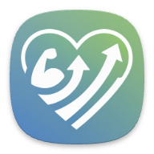

# Health Connect Log

<p align="center">
  
</p>

<p align="center">
  <strong>Log your workouts to Health Connect with a single tap.</strong>
</p>

<p align="center">
  <a href="https://github.com/Drarox/Health-Connect-Log/issues"></a>
  <a href="https://github.com/Drarox/Health-Connect-Log/pulls"></a>
</p>

---

## 🤔 Why Health Connect Log?

Have you ever been in a situation where you couldn't track your workout because you didn't have your phone or watch with you? Maybe you were playing a team sport, swimming, or simply forgot your device.

**Health Connect Log** was created for those moments. It allows you to log with one click your past workouts to various health tracking apps like Google Fit, Samsung Health, and others that are compatible with Android's Health Connect. This way, you never miss a session and your health data stays complete.

## ✨ Features

*   **Workout Presets**: Create templates for your recurring workouts (e.g., "Monday Evening Run", "Wednesday Gym Session").
*   **One-Tap Logging**: Log a workout from a preset with just a single tap.
*   **Customizable**: Set duration, calories burned, workout type, day of the week, and time for each preset.
*   **Seamless Integration**: Connects directly with Health Connect to sync your data across your favorite health apps.
*   **Modern & Simple UI**: A clean and intuitive interface built with Material 3.


## 🚀 Getting Started

### Prerequisites

*   An Android device with [Health Connect](https://play.google.com/store/apps/details?id=com.google.android.apps.healthdata) installed.

### Download on Google Play Store

[](https://play.google.com/store/apps/details?id=com.healthconnectlog.health_connect_log)

### Or build it yourself
Flutter SDK have to be installed on your machine.

1.  **Clone the repository:**
    ```bash
    git clone https://github.com/Drarox/Health-Connect-Log.git
    ```
2.  **Navigate to the project directory:**
    ```bash
    cd Health-Connect-Log
    ```
3.  **Install dependencies:**
    ```bash
    flutter pub get
    ```
4.  **Run the app:**
    ```bash
    flutter run
    ```

## 🤝 Contributing

Contributions are what make the open-source community such an amazing place to learn, inspire, and create. Any contributions you make are **greatly appreciated**.

If you have a suggestion that would make this better, please fork the repo and create a pull request. You can also simply open an issue with the tag "enhancement".

1.  Fork the Project
2.  Create your Feature Branch (`git checkout -b feature/AmazingFeature`)
3.  Commit your Changes (`git commit -m 'Add some AmazingFeature'`)
4.  Push to the Branch (`git push origin feature/AmazingFeature`)
5.  Open a Pull Request


## 📄 License

This project is licensed under [GPL-3.0 license](https://github.com/Drarox/Health-Connect-Log/blob/master/LICENSE).